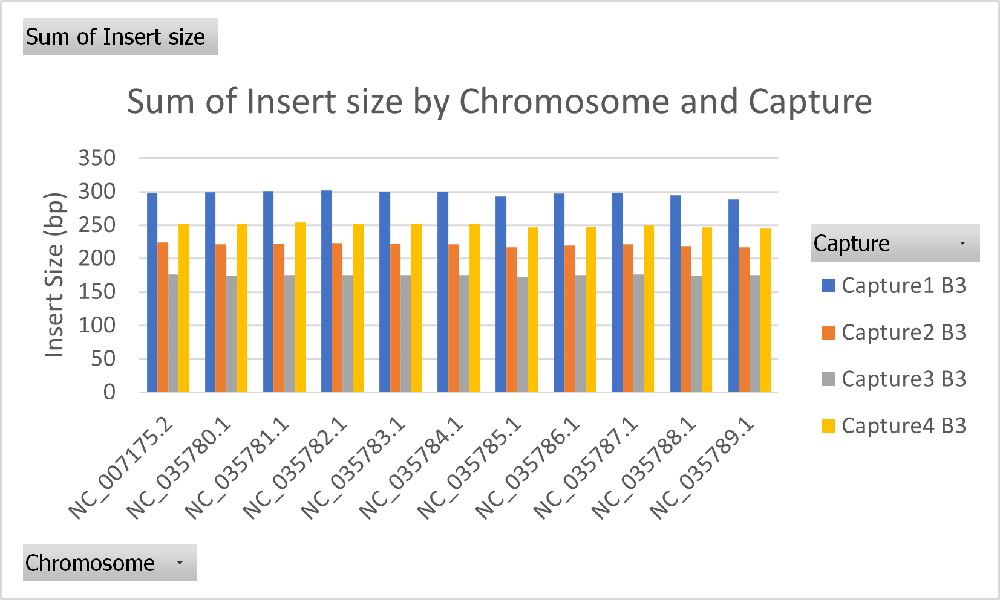

# This file shows the work in analyzing individual fastq, fasta, and bam files.

After our merged analysis we recognized that we still needed to investigate sample by sample variation within our dataset. To do this we applied a similar analytical framework of bam files as we did in the merged capture pools.

One caveat here is that we will be merging PE FASTQ files that are overlapping into SE files. Using Geneious we found that Capture 2,3, and 4 have read intervals less than 2x their read length which can lead to more overlaps between PE read. 



The result will be a PE and SE fastq file which will be mapped to the reference. From here we will merged the PE and SE bam files together and proceed with normalization.

## Merging PE reads from a single individual sample

To merge PE reads we will be using the program [FASTP](https://github.com/OpenGene/fastp)

```bash
#Single file
fastp -m --in1 ../clean/Capture1_B3.F.fq.gz --out1 Capture1_B3.F.fastp.fq.gz --in2 ../clean/Capture1_B3.R.fq.gz --out2 Capture1_B3.R.fastp.fq.gz --merged_out Capture1_B3_merged.fq.gz -D -p --report_title "Capture1_B3_fastp_report"

#All files
declare -a StringArray=("Capture1_B3" "Capture1_B4" "Capture1_G3" "Capture1_G5" "Capture1_K3" "Capture1_K4" "Capture1_M3" "Capture1_M4" "Capture1_N2" "Capture2_B3" "Capture2_B4" "Capture2_G3" "Capture2_G5" "Capture2_K3" "Capture2_K4" "Capture2_M3" "Capture2_M4" "Capture2_N2" "Capture3_B3" "Capture3_B4" "Capture3_G3" "Capture3_G5" "Capture3_K3" "Capture3_K4" "Capture3_M3" "Capture3_M4" "Capture3_N2" "Capture4_B3" "Capture4_B4" "Capture4_G3" "Capture4_G5" "Capture4_K3" "Capture4_K4" "Capture4_M3" "Capture4_M4" "Capture4_N2")

for i in "${StringArray[@]}"
do
fastp -m --in1 ../clean/${i}.F.fq.gz --out1 ${i}.F.fq.gz --in2 ../clean/${i}.R.fq.gz --out2 ${i}.R.fq.gz --merged_out ${i}.SE.fq.gz -D -p -R "${i}" -j ${i}.json -h ${i}.html
done
```

## Run fastqc and multiqc to visualize files

```bash
fastqc -f fastq -t 20 *.fq.gz
multiqc . -o post_demux_multiqc_report
```

## Create directory in 02_ddocent for single and PE fastp filtered reads
```bash
mkdir 01_PE
mkdir 02_PEfastp
mkdir 03_SEfastp
mkdir 04_probes
mkdir 05_Merged_bam
```

Note: Naming convention for dDocent files is very important
* PE must contain F.fq.gz and R.fq.gz for their identifier with correct prefix names listed in the popmap file
* SE must contain F.fq.gz for their identifier with correct prefix names listed in popmap file.

## Run the dDocent script in the directory containing our newly named files

```bash
/../scripts/dDocent_ngs.sh config.file
```

## Normalizing F.bam files for each individual subsample

These lines of code were ran in each of the directories 02_PEfastp and 03_SEfastp

Figure out a normal value for either each individual groups or across all groups

```bash
declare -a StringArray=("Capture1_B3" "Capture1_B4" "Capture1_G3" "Capture1_G5" "Capture1_K3" "Capture1_K4" "Capture1_M3" "Capture1_M4" "Capture1_N2" "Capture2_B3" "Capture2_B4" "Capture2_G3" "Capture2_G5" "Capture2_K3" "Capture2_K4" "Capture2_M3" "Capture2_M4" "Capture2_N2" "Capture3_B3" "Capture3_B4" "Capture3_G3" "Capture3_G5" "Capture3_K3" "Capture3_K4" "Capture3_M3" "Capture3_M4" "Capture3_N2" "Capture4_B3" "Capture4_B4" "Capture4_G3" "Capture4_G5" "Capture4_K3" "Capture4_K4" "Capture4_M3" "Capture4_M4" "Capture4_N2")
for i in  "${StringArray[@]}"
do
alignment_reads=$(samtools view -c ${i}.F.bam)
echo " ${i} , Number of alignment reads: $alignment_reads" >> bamalignedreads.txt
done

declare -a StringArray=("B3" "B4" "G3" "G5" "K3" "K4" "M3" "M4" "N2")
for i in  "${StringArray[@]}"
do
grep "${i}" bamalignedreads.txt
done
```

Use the previous bamalignedreads.txt file to set the value in $frac for subsampling bam files


# Normalizing for the single end files 

```bash
#B3
declare -a StringArray=("Capture1" "Capture2" "Capture3" "Capture4")
for i in "${StringArray[@]}"
do
frac=$( samtools idxstats ${i}_B3.F.bam | cut -f3 | awk 'BEGIN {total=0} {total += $1} END {frac=341406/total; if (frac > 1) {print 1} else {print frac}}' )
samtools view -bs $frac ${i}_B3.F.bam > ${i}.SEnorm.B3.F.bam
done
#B4
declare -a StringArray=("Capture1" "Capture2" "Capture3" "Capture4")
for i in "${StringArray[@]}"
do
frac=$( samtools idxstats ${i}_B4.F.bam | cut -f3 | awk 'BEGIN {total=0} {total += $1} END {frac=437026/total; if (frac > 1) {print 1} else {print frac}}' )
samtools view -bs $frac ${i}_B4.F.bam > ${i}.SEnorm.B4.F.bam
done
#G3
declare -a StringArray=("Capture1" "Capture2" "Capture3" "Capture4")
for i in "${StringArray[@]}"
do
frac=$( samtools idxstats ${i}_G3.F.bam | cut -f3 | awk 'BEGIN {total=0} {total += $1} END {frac=393957/total; if (frac > 1) {print 1} else {print frac}}' )
samtools view -bs $frac ${i}_G3.F.bam > ${i}.SEnorm.G3.F.bam
done
#G5
declare -a StringArray=("Capture1" "Capture2" "Capture3" "Capture4")
for i in "${StringArray[@]}"
do
frac=$( samtools idxstats ${i}_G5.F.bam | cut -f3 | awk 'BEGIN {total=0} {total += $1} END {frac=711352/total; if (frac > 1) {print 1} else {print frac}}' )
samtools view -bs $frac ${i}_G5.F.bam > ${i}.SEnorm.G5.F.bam
done
#K3
declare -a StringArray=("Capture1" "Capture2" "Capture3" "Capture4")
for i in "${StringArray[@]}"
do
frac=$( samtools idxstats ${i}_K3.F.bam | cut -f3 | awk 'BEGIN {total=0} {total += $1} END {frac=456015/total; if (frac > 1) {print 1} else {print frac}}' )
samtools view -bs $frac ${i}_K3.F.bam > ${i}.SEnorm.K3.F.bam
done
#K4
declare -a StringArray=("Capture1" "Capture2" "Capture3" "Capture4")
for i in "${StringArray[@]}"
do
frac=$( samtools idxstats ${i}_K4.F.bam | cut -f3 | awk 'BEGIN {total=0} {total += $1} END {frac=834290/total; if (frac > 1) {print 1} else {print frac}}' )
samtools view -bs $frac ${i}_K4.F.bam > ${i}.SEnorm.K4.F.bam
done
#M3
declare -a StringArray=("Capture1" "Capture2" "Capture3" "Capture4")
for i in "${StringArray[@]}"
do
frac=$( samtools idxstats ${i}_M3.F.bam | cut -f3 | awk 'BEGIN {total=0} {total += $1} END {frac=886699/total; if (frac > 1) {print 1} else {print frac}}' )
samtools view -bs $frac ${i}_M3.F.bam > ${i}.SEnorm.M3.F.bam
done
#M4
declare -a StringArray=("Capture1" "Capture2" "Capture3" "Capture4")
for i in "${StringArray[@]}"
do
frac=$( samtools idxstats ${i}_M4.F.bam | cut -f3 | awk 'BEGIN {total=0} {total += $1} END {frac=700407/total; if (frac > 1) {print 1} else {print frac}}' )
samtools view -bs $frac ${i}_M4.F.bam > ${i}.SEnorm.M4.F.bam
done
#N2
declare -a StringArray=("Capture1" "Capture2" "Capture3" "Capture4")
for i in "${StringArray[@]}"
do
frac=$( samtools idxstats ${i}_N2.F.bam | cut -f3 | awk 'BEGIN {total=0} {total += $1} END {frac=1182834/total; if (frac > 1) {print 1} else {print frac}}' )
samtools view -bs $frac ${i}_N2.F.bam > ${i}.SEnorm.N2.F.bam
done
```

## Normalizing for the pair end files

```bash
#B3
declare -a StringArray=("Capture1" "Capture2" "Capture3" "Capture4")
for i in "${StringArray[@]}"
do
frac=$( samtools idxstats ${i}_B3.F.bam | cut -f3 | awk 'BEGIN {total=0} {total += $1} END {frac=92408/total; if (frac > 1) {print 1} else {print frac}}' )
samtools view -bs $frac ${i}_B3.F.bam > ${i}.PEnorm.B3.F.bam
done
#B4
declare -a StringArray=("Capture1" "Capture2" "Capture3" "Capture4")
for i in "${StringArray[@]}"
do
frac=$( samtools idxstats ${i}_B4.F.bam | cut -f3 | awk 'BEGIN {total=0} {total += $1} END {frac=297790/total; if (frac > 1) {print 1} else {print frac}}' )
samtools view -bs $frac ${i}_B4.F.bam > ${i}.PEnorm.B4.F.bam
done
#G3
declare -a StringArray=("Capture1" "Capture2" "Capture3" "Capture4")
for i in "${StringArray[@]}"
do
frac=$( samtools idxstats ${i}_G3.F.bam | cut -f3 | awk 'BEGIN {total=0} {total += $1} END {frac=372522/total; if (frac > 1) {print 1} else {print frac}}' )
samtools view -bs $frac ${i}_G3.F.bam > ${i}.PEnorm.G3.F.bam
done
#G5
declare -a StringArray=("Capture1" "Capture2" "Capture3" "Capture4")
for i in "${StringArray[@]}"
do
frac=$( samtools idxstats ${i}_G5.F.bam | cut -f3 | awk 'BEGIN {total=0} {total += $1} END {frac=494376/total; if (frac > 1) {print 1} else {print frac}}' )
samtools view -bs $frac ${i}_G5.F.bam > ${i}.PEnorm.G5.F.bam
done
#K3
declare -a StringArray=("Capture1" "Capture2" "Capture3" "Capture4")
for i in "${StringArray[@]}"
do
frac=$( samtools idxstats ${i}_K3.F.bam | cut -f3 | awk 'BEGIN {total=0} {total += $1} END {frac=374385/total; if (frac > 1) {print 1} else {print frac}}' )
samtools view -bs $frac ${i}_K3.F.bam > ${i}.PEnorm.K3.F.bam
done
#K4
declare -a StringArray=("Capture1" "Capture2" "Capture3" "Capture4")
for i in "${StringArray[@]}"
do
frac=$( samtools idxstats ${i}_K4.F.bam | cut -f3 | awk 'BEGIN {total=0} {total += $1} END {frac=327371/total; if (frac > 1) {print 1} else {print frac}}' )
samtools view -bs $frac ${i}_K4.F.bam > ${i}.PEnorm.K4.F.bam
done
#M3
declare -a StringArray=("Capture1" "Capture2" "Capture3" "Capture4")
for i in "${StringArray[@]}"
do
frac=$( samtools idxstats ${i}_M3.F.bam | cut -f3 | awk 'BEGIN {total=0} {total += $1} END {frac=816051/total; if (frac > 1) {print 1} else {print frac}}' )
samtools view -bs $frac ${i}_M3.F.bam > ${i}.PEnorm.M3.F.bam
done
#M4
declare -a StringArray=("Capture1" "Capture2" "Capture3" "Capture4")
for i in "${StringArray[@]}"
do
frac=$( samtools idxstats ${i}_M4.F.bam | cut -f3 | awk 'BEGIN {total=0} {total += $1} END {frac=481006/total; if (frac > 1) {print 1} else {print frac}}' )
samtools view -bs $frac ${i}_M4.F.bam > ${i}.PEnorm.M4.F.bam
done
#N2
declare -a StringArray=("Capture1" "Capture2" "Capture3" "Capture4")
for i in "${StringArray[@]}"
do
frac=$( samtools idxstats ${i}_N2.F.bam | cut -f3 | awk 'BEGIN {total=0} {total += $1} END {frac=360107/total; if (frac > 1) {print 1} else {print frac}}' )
samtools view -bs $frac ${i}_N2.F.bam > ${i}.PEnorm.N2.F.bam
done
```

Merge SE and PE bam files into a single bam file

```bash
declare -a StringArray=("Capture1" "Capture2" "Capture3" "Capture4")
for i in "${StringArray[@]}"
do
samtools merge --threads 20 -o /home/jgreen/eager_obj1a/02_ddocent/05_Merged_bam/${i}_B3.F.bam /home/jgreen/eager_obj1a/02_ddocent/02_PEfastp/${i}_B3.F.bam /home/jgreen/eager_obj1a/02_ddocent/03_SEfastp/${i}_B3.F.bam
done

declare -a StringArray=("Capture1" "Capture2" "Capture3" "Capture4")
for i in "${StringArray[@]}"
do
samtools merge --threads 20 -o /home/jgreen/eager_obj1a/02_ddocent/05_Merged_bam/${i}_B4.F.bam /home/jgreen/eager_obj1a/02_ddocent/02_PEfastp/${i}_B4.F.bam /home/jgreen/eager_obj1a/02_ddocent/03_SEfastp/${i}_B4.F.bam
done

declare -a StringArray=("Capture1" "Capture2" "Capture3" "Capture4")
for i in "${StringArray[@]}"
do
samtools merge --threads 20 -o /home/jgreen/eager_obj1a/02_ddocent/05_Merged_bam/${i}_G3.F.bam /home/jgreen/eager_obj1a/02_ddocent/02_PEfastp/${i}_G3.F.bam /home/jgreen/eager_obj1a/02_ddocent/03_SEfastp/${i}_G3.F.bam
done

declare -a StringArray=("Capture1" "Capture2" "Capture3" "Capture4")
for i in "${StringArray[@]}"
do
samtools merge --threads 20 -o /home/jgreen/eager_obj1a/02_ddocent/05_Merged_bam/${i}_G5.F.bam /home/jgreen/eager_obj1a/02_ddocent/02_PEfastp/${i}_G5.F.bam /home/jgreen/eager_obj1a/02_ddocent/03_SEfastp/${i}_G5.F.bam
done

declare -a StringArray=("Capture1" "Capture2" "Capture3" "Capture4")
for i in "${StringArray[@]}"
do
samtools merge --threads 20 -o /home/jgreen/eager_obj1a/02_ddocent/05_Merged_bam/${i}_K3.F.bam /home/jgreen/eager_obj1a/02_ddocent/02_PEfastp/${i}_K3.F.bam /home/jgreen/eager_obj1a/02_ddocent/03_SEfastp/${i}_K3.F.bam
done

declare -a StringArray=("Capture1" "Capture2" "Capture3" "Capture4")
for i in "${StringArray[@]}"
do
samtools merge --threads 20 -o /home/jgreen/eager_obj1a/02_ddocent/05_Merged_bam/${i}_K4.F.bam /home/jgreen/eager_obj1a/02_ddocent/02_PEfastp/${i}_K4.F.bam /home/jgreen/eager_obj1a/02_ddocent/03_SEfastp/${i}_K4.F.bam
done

declare -a StringArray=("Capture1" "Capture2" "Capture3" "Capture4")
for i in "${StringArray[@]}"
do
samtools merge --threads 20 -o /home/jgreen/eager_obj1a/02_ddocent/05_Merged_bam/${i}_M3.F.bam /home/jgreen/eager_obj1a/02_ddocent/02_PEfastp/${i}_M3.F.bam /home/jgreen/eager_obj1a/02_ddocent/03_SEfastp/${i}_M3.F.bam
done

declare -a StringArray=("Capture1" "Capture2" "Capture3" "Capture4")
for i in "${StringArray[@]}"
do
samtools merge --threads 20 -o /home/jgreen/eager_obj1a/02_ddocent/05_Merged_bam/${i}_M4.F.bam /home/jgreen/eager_obj1a/02_ddocent/02_PEfastp/${i}_M4.F.bam /home/jgreen/eager_obj1a/02_ddocent/03_SEfastp/${i}_M4.F.bam
done

declare -a StringArray=("Capture1" "Capture2" "Capture3" "Capture4")
for i in "${StringArray[@]}"
do
samtools merge --threads 20 -o /home/jgreen/eager_obj1a/02_ddocent/05_Merged_bam/${i}_N2.F.bam /home/jgreen/eager_obj1a/02_ddocent/02_PEfastp/${i}_N2.F.bam /home/jgreen/eager_obj1a/02_ddocent/03_SEfastp/${i}_M4.F.bam
done
```

Figure out a normal value for either each individual bam file

```bash
declare -a StringArray=("Capture1_B3" "Capture1_B4" "Capture1_G3" "Capture1_G5" "Capture1_K3" "Capture1_K4" "Capture1_M3" "Capture1_M4" "Capture1_N2" "Capture2_B3" "Capture2_B4" "Capture2_G3" "Capture2_G5" "Capture2_K3" "Capture2_K4" "Capture2_M3" "Capture2_M4" "Capture2_N2" "Capture3_B3" "Capture3_B4" "Capture3_G3" "Capture3_G5" "Capture3_K3" "Capture3_K4" "Capture3_M3" "Capture3_M4" "Capture3_N2" "Capture4_B3" "Capture4_B4" "Capture4_G3" "Capture4_G5" "Capture4_K3" "Capture4_K4" "Capture4_M3" "Capture4_M4" "Capture4_N2")
for i in  "${StringArray[@]}"
do
alignment_reads=$(samtools view -c ${i}.F.bam)
echo " ${i} , Number of alignment reads: $alignment_reads" >> bamalignedreads.txt
done

declare -a StringArray=("B3" "B4" "G3" "G5" "K3" "K4" "M3" "M4" "N2")
for i in  "${StringArray[@]}"
do
grep "${i}" bamalignedreads.txt
done
```

Normalize bam files based on lowest count within the bamalignedreads file

```bash
#B3
declare -a StringArray=("Capture1" "Capture2" "Capture3" "Capture4")
for i in "${StringArray[@]}"
do
frac=$( samtools idxstats ${i}_B3.F.bam | cut -f3 | awk 'BEGIN {total=0} {total += $1} END {frac=433815/total; if (frac > 1) {print 1} else {print frac}}' )
samtools view -bs $frac ${i}_B3.F.bam > ${i}.merged.norm.B3.F.bam
done
#B4
declare -a StringArray=("Capture1" "Capture2" "Capture3" "Capture4")
for i in "${StringArray[@]}"
do
frac=$( samtools idxstats ${i}_B4.F.bam | cut -f3 | awk 'BEGIN {total=0} {total += $1} END {frac=1109935/total; if (frac > 1) {print 1} else {print frac}}' )
samtools view -bs $frac ${i}_B4.F.bam > ${i}.merged.norm.B4.F.bam
done
#G3
declare -a StringArray=("Capture1" "Capture2" "Capture3" "Capture4")
for i in "${StringArray[@]}"
do
frac=$( samtools idxstats ${i}_G3.F.bam | cut -f3 | awk 'BEGIN {total=0} {total += $1} END {frac=1451032/total; if (frac > 1) {print 1} else {print frac}}' )
samtools view -bs $frac ${i}_G3.F.bam > ${i}.merged.norm.G3.F.bam
done
#G5
declare -a StringArray=("Capture1" "Capture2" "Capture3" "Capture4")
for i in "${StringArray[@]}"
do
frac=$( samtools idxstats ${i}_G5.F.bam | cut -f3 | awk 'BEGIN {total=0} {total += $1} END {frac=1570060/total; if (frac > 1) {print 1} else {print frac}}' )
samtools view -bs $frac ${i}_G5.F.bam > ${i}.merged.norm.G5.F.bam
done
#K3
declare -a StringArray=("Capture1" "Capture2" "Capture3" "Capture4")
for i in "${StringArray[@]}"
do
frac=$( samtools idxstats ${i}_K3.F.bam | cut -f3 | awk 'BEGIN {total=0} {total += $1} END {frac=1525961/total; if (frac > 1) {print 1} else {print frac}}' )
samtools view -bs $frac ${i}_K3.F.bam > ${i}.merged.norm.K3.F.bam
done
#K4
declare -a StringArray=("Capture1" "Capture2" "Capture3" "Capture4")
for i in "${StringArray[@]}"
do
frac=$( samtools idxstats ${i}_K4.F.bam | cut -f3 | awk 'BEGIN {total=0} {total += $1} END {frac=1643361/total; if (frac > 1) {print 1} else {print frac}}' )
samtools view -bs $frac ${i}_K4.F.bam > ${i}.merged.norm.K4.F.bam
done
#M3
declare -a StringArray=("Capture1" "Capture2" "Capture3" "Capture4")
for i in "${StringArray[@]}"
do
frac=$( samtools idxstats ${i}_M3.F.bam | cut -f3 | awk 'BEGIN {total=0} {total += $1} END {frac=2700309/total; if (frac > 1) {print 1} else {print frac}}' )
samtools view -bs $frac ${i}_M3.F.bam > ${i}.merged.norm.M3.F.bam
done
#M4
declare -a StringArray=("Capture1" "Capture2" "Capture3" "Capture4")
for i in "${StringArray[@]}"
do
frac=$( samtools idxstats ${i}_M4.F.bam | cut -f3 | awk 'BEGIN {total=0} {total += $1} END {frac=1618936/total; if (frac > 1) {print 1} else {print frac}}' )
samtools view -bs $frac ${i}_M4.F.bam > ${i}.merged.norm.M4.F.bam
done
#N2
declare -a StringArray=("Capture1" "Capture2" "Capture3" "Capture4")
for i in "${StringArray[@]}"
do
frac=$( samtools idxstats ${i}_N2.F.bam | cut -f3 | awk 'BEGIN {total=0} {total += $1} END {frac=1498036/total; if (frac > 1) {print 1} else {print frac}}' )
samtools view -bs $frac ${i}_N2.F.bam > ${i}.merged.norm.N2.F.bam
done
```

```bash
declare -a StringArray=("Capture1.merged.norm.B3" "Capture1.merged.norm.B4" "Capture1.merged.norm.G3" "Capture1.merged.norm.G5" "Capture1.merged.norm.K3" "Capture1.merged.norm.K4" "Capture1.merged.norm.M3" "Capture1.merged.norm.M4" "Capture1.merged.norm.N2" "Capture2.merged.norm.B3" "Capture2.merged.norm.B4" "Capture2.merged.norm.G3" "Capture2.merged.norm.G5" "Capture2.merged.norm.K3" "Capture2.merged.norm.K4" "Capture2.merged.norm.M3" "Capture2.merged.norm.M4" "Capture2.merged.norm.N2" "Capture3.merged.norm.B3" "Capture3.merged.norm.B4" "Capture3.merged.norm.G3" "Capture3.merged.norm.G5" "Capture3.merged.norm.K3" "Capture3.merged.norm.K4" "Capture3.merged.norm.M3" "Capture3.merged.norm.M4" "Capture3.merged.norm.N2" "Capture4.merged.norm.B3" "Capture4.merged.norm.B4" "Capture4.merged.norm.G3" "Capture4.merged.norm.G5" "Capture4.merged.norm.K3" "Capture4.merged.norm.K4" "Capture4.merged.norm.M3" "Capture4.merged.norm.M4" "Capture4.merged.norm.N2")

#CDS
#Looping for all samples CDS
for i in "${StringArray[@]}"
do
bedtools coverage -hist -b $WORKING_DIR/03_mapping/02_insert_norm/${i}.F.bam -a $WORKING_DIR/Genome/sorted.ref3.0.CDS.sc.hmask.bed -g $WORKING_DIR/Genome/masked.genome.file -sorted -split | grep ^all > $WORKING_DIR/04_coverage_analysis/01_genome_region/02_insert_norm/${i}.AllCDS.all.split.txt
done
#Exon
for i in "${StringArray[@]}"
do
bedtools coverage -hist -b $WORKING_DIR/03_mapping/02_insert_norm/${i}.F.bam -a $WORKING_DIR/Genome/sorted.ref3.0.exon.sc.hmask.bed -g $WORKING_DIR/Genome/masked.genome.file -sorted -split | grep ^all > $WORKING_DIR/04_coverage_analysis/01_genome_region/02_insert_norm/${i}.AllExon.all.split.txt
done
#Gene
for i in "${StringArray[@]}"
do
bedtools coverage -hist -b $WORKING_DIR/03_mapping/02_insert_norm/${i}.F.bam -a $WORKING_DIR/Genome/sorted.ref3.0.gene.sc.hmask.bed -g $WORKING_DIR/Genome/masked.genome.file -sorted -split | grep ^all > $WORKING_DIR/04_coverage_analysis/01_genome_region/02_insert_norm/${i}.AllGene.all.split.txt
done
#UTR
for i in "${StringArray[@]}"
do
bedtools coverage -hist -b $WORKING_DIR/03_mapping/02_insert_norm/${i}.F.bam -a $WORKING_DIR/Genome/sorted.ref3.0.UTR.sc.hmask.bed -g $WORKING_DIR/Genome/masked.genome.file -sorted -split | grep ^all > $WORKING_DIR/04_coverage_analysis/01_genome_region/02_insert_norm/${i}.AllUTR.all.split.txt
done
```

R code for calculating %Bases > Depth for all Captures and Samples

```R all Capture B3 subsample
library(ggplot2)
library(grid)
library(plyr)
library(dplyr)
library(scales)
library(zoo)


s# Set your working directory
setwd("/home/jgreen/eager_obj1a/04_coverage_analysis/01_genome_region/02_insert_norm/")

# Define the capture you want to isolate
capture <- "Capture1"

# Initialize an empty list to store ggplot objects
plot_list <- list()

# List of all samples
samples <- c("B3", "B4", "G3", "G5", "K3", "K4", "M3", "M4", "N2")

# Loop through each sample
for (sample in samples) {
  # Create the file name based on the sample and capture
  file <- paste0(capture, ".merged.norm.", sample)
  
  # Print the current file being processed
  print(file)
  
  # Get a list of files for the current capture and sample
  files_list <- list.files(pattern = file)
  print(files_list)
  
  # Specify the files you want to process for each sample
  files <- c(
    paste0(file, ".AllCDS.all.split.txt"),
    paste0(file, ".AllExon.all.split.txt"),
    paste0(file, ".AllGene.all.split.txt"),
    paste0(file, ".AllUTR.all.split.txt")
  )
  print(files)
  
  # Labels for different data types
  labs <- c("CDS", "Exon", "Gene", "UTR")
  
  # Initialize a list to store data for each data type
  cov <- list()
  
  # Loop through each file and data type
  for (i in 1:length(files)) {
    cov[[i]] <- read.table(files[i])[, c(2, 5)]
    cov_cumul <- 1 - cumsum(cov[[i]][, 2])
    cov[[i]]$cov_cumul <- c(1, cov_cumul[-length(cov_cumul)])
    cov[[i]]$sample <- labs[i]
  }
  
  # Combine data for all data types
  cov_df <- do.call("rbind", cov)
  names(cov_df)[1:2] <- c("depth", "fraction")
  
  # Color palette
  pcbPalette <- c("#009E73", "#D55E00", "#CC79A7", "#56B4E9")
  
  # Create a ggplot
  p1 <- ggplot(cov_df, aes(x = depth, y = cov_cumul, color = sample, linetype = sample)) +
    xlim(0, 10) +
    scale_alpha(guide = 'none') +
    geom_line(size = 0.5) +
    scale_color_manual(values = pcbPalette) +
    scale_fill_manual(values = pcbPalette) +
    ggtitle(paste("Read Depth Distribution for", capture, "(", sample, ")")) +
    ylab("% of Bases > Depth") +
    xlab("Depth") +
    theme_bw() +
    theme(axis.text = element_text(size = 5),axis.title = element_text(size = 5,face = "bold")) +
    theme(plot.title = element_text(size = 5, face = "bold", hjust = 0.5)) +
    theme(legend.position = "none")
  
  # Append the plot to the list
  plot_list[[sample]] <- p1
  
  # Save the individual plot as a PNG file
  png(
    filename = paste0("Figure2_", capture, "_", sample, ".png"),
    type = "cairo",
    units = "px",
    width = 5600,
    height = 3000,
    res = 600,
    bg = "transparent"
  )
  
  print(p1)
  dev.off()
}

# Combine all the ggplot objects in the list using grid.arrange()
pcombined <- grid.arrange(
  grobs = plot_list,
  ncol = 3,  # Adjust the number of columns as needed
  top = textGrob(paste("Read Depth Distribution for", capture, "across Samples"))
)

# Save the combined plot as a PNG file
ggsave(file = paste0("Figure2_", capture, "_Combined.png"), pcombined)
```

# Generate data for Table with mapped read stats

```bash
declare -a StringArray=("Capture1_B3" "Capture1_B4" "Capture1_G3" "Capture1_G5" "Capture1_K3" "Capture1_K4" "Capture1_M3" "Capture1_M4" "Capture1_N2" "Capture2_B3" "Capture2_B4" "Capture2_G3" "Capture2_G5" "Capture2_K3" "Capture2_K4" "Capture2_M3" "Capture2_M4" "Capture2_N2" "Capture3_B3" "Capture3_B4" "Capture3_G3" "Capture3_G5" "Capture3_K3" "Capture3_K4" "Capture3_M3" "Capture3_M4" "Capture3_N2" "Capture4_B3" "Capture4_B4" "Capture4_G3" "Capture4_G5" "Capture4_K3" "Capture4_K4" "Capture4_M3" "Capture4_M4" "Capture4_N2")

for i in "${StringArray[@]}"
do 
nom=$(samtools view -@32 $WORKING_DIR/03_mapping/02_insert_norm/${i}.F.bam -c -L $WORKING_DIR/Genome/mtDNA.bed); denom=$(samtools view -@32 $WORKING_DIR/03_mapping/02_insert_norm/${i}.F.bam -c); dup=$(mawk '/Unknown/' $WORKING_DIR/02_ddocent/01_PE/logfiles/${i}_dup_metrics.txt | cut -f9); paste <(echo $i) <(echo $(( `zcat $WORKING_DIR/01_process_reads/raw/${i}.R1.fastq.gz | wc -l` /4 ))) <(echo $(( `zcat $WORKING_DIR/01_process_reads/clean/${i}.F.fq.gz | wc -l` /4 ))) <(samtools view -@ 32 $WORKING_DIR/02_ddocent/01_PE/${i}-RGmd.bam -c) <(python -c "print(round("$dup" * 100,2))") <(echo $denom) <(python -c "print(round("$nom"/"$denom" *100,2))") 
done > data.table2
echo -e "Pool\tRaw_Reads\tFiltered_Reads\tMapped_Reads\t%_Duplicate\tFiltered_Mapped_Reads\t%_mapping_to_mitochondrial_genome" > header
cat header data.table2 > Table2.txt
```

## Generate data for Figure 3

Calculate Exon percentiles

Get total coverage counts for all merged

```bash
bedtools coverage -b $WORKING_DIR/03_mapping/all.filter.merged.bam -a $WORKING_DIR/Genome/sorted.ref3.0.exon.sc.hmask.bed -g $WORKING_DIR/Genome/masked.genome.file -mean -split > $WORKING_DIR/04_coverage_analysis/02_exon_stats/all.merged.cov.mean.exon.stats
```

Get total coverage counts per exon per capture
```bash
declare -a StringArray=("Capture1_B3" "Capture1_B4" "Capture1_G3" "Capture1_G5" "Capture1_K3" "Capture1_K4" "Capture1_M3" "Capture1_M4" "Capture1_N2" "Capture2_B3" "Capture2_B4" "Capture2_G3" "Capture2_G5" "Capture2_K3" "Capture2_K4" "Capture2_M3" "Capture2_M4" "Capture2_N2" "Capture3_B3" "Capture3_B4" "Capture3_G3" "Capture3_G5" "Capture3_K3" "Capture3_K4" "Capture3_M3" "Capture3_M4" "Capture3_N2" "Capture4_B3" "Capture4_B4" "Capture4_G3" "Capture4_G5" "Capture4_K3" "Capture4_K4" "Capture4_M3" "Capture4_M4" "Capture4_N2")

for i in "${StringArray[@]}"
do
bedtools coverage -b $WORKING_DIR/03_mapping/02_insert_norm/${i}.F.bam -a $WORKING_DIR/Genome/sorted.ref3.0.exon.sc.hmask.bed -g $WORKING_DIR/Genome/masked.genome.file -mean -split > $WORKING_DIR/04_coverage_analysis/02_exon_stats/02_insert_norm/${i}.insert.merged.cov.mean.filtered.exon.stats
done
```

Goal is to compare capture1 against all others

Remove mtDNA from stat files

```bash

#Merged files
declare -a StringArray=("Capture1_B3" "Capture1_B4" "Capture1_G3" "Capture1_G5" "Capture1_K3" "Capture1_K4" "Capture1_M3" "Capture1_M4" "Capture1_N2" "Capture2_B3" "Capture2_B4" "Capture2_G3" "Capture2_G5" "Capture2_K3" "Capture2_K4" "Capture2_M3" "Capture2_M4" "Capture2_N2" "Capture3_B3" "Capture3_B4" "Capture3_G3" "Capture3_G5" "Capture3_K3" "Capture3_K4" "Capture3_M3" "Capture3_M4" "Capture3_N2" "Capture4_B3" "Capture4_B4" "Capture4_G3" "Capture4_G5" "Capture4_K3" "Capture4_K4" "Capture4_M3" "Capture4_M4" "Capture4_N2")

for i in  "${StringArray[@]}"
do
mawk '!/NC_007175.2/' ${i}.insert.merged.cov.mean.filtered.exon.stats > ${i}.insert.merged.DNA.mean.exon.stats
done

#All files
mawk '!/NC_007175.2/' all.merged.cov.mean.exon.stats > all.DNA.merged.mean.exon.stats
```

Calculate lower 10th percentile of exon sizes


```bash
for i in  "${StringArray[@]}"
do
mawk '{print $3 -$2}' ${i}.insert.merged.DNA.mean.exon.stats |sort -g | perl -e '$d=.1;@l=<>;print $l[int($d*@l)]'
done
```

Result: 58 for all samples


Calculate upper 10th percentile of exon sizes


```bash
for i in  "${StringArray[@]}"
do
mawk '{print $3 -$2}' ${i}.insert.merged.DNA.mean.exon.stats |sort -g | perl -e '$d=.9;@l=<>;print $l[int($d*@l)]'
done
```

Result: 524 for all samples


Mark exons into size classes based on size distribution and create data table
```bash
for i in  "${StringArray[@]}"
do
mawk '{if ( $3 -$2 > 524 ) print $0 "\tUpper"; else if ( $3 - $2 < 58 ) print $0 "\tLower"; else if ( $3 - $2 > 58 && $3 - $2 < 524) print $0 "\tMiddle" }' ${i}.insert.merged.DNA.mean.exon.stats > ${i}.insert.merged.DNA.mean.cov.exon.stats.class
done

echo -e "Chrom\tStart\tEnd\tDNA_Coverage\tExon_Size_Class" > header

for i in  "${StringArray[@]}"
do
cat header ${i}.insert.merged.DNA.mean.cov.exon.stats.class > ${i}.insert.merged.ExonMeanCoverage.txt
done
```

```R Set Libraries and Working Directory
library(MASS)
library(fields)
library(ggplot2)
library(grid)
library(plyr)
library(dplyr)
library(scales)
library(zoo)
```

```R
{r All density analysis combined with pairwise T-test and ANOVA}
setwd("/home/jgreen/eager_obj1a/04_coverage_analysis/02_exon_stats/02_insert_norm/")
# Define a list of capture names and sample names
# Define a list of capture names and sample names
captures <- c("Capture1", "Capture2", "Capture3", "Capture4")
samples <- c("B3", "B4", "G3", "G5", "K3", "K4", "M3", "M4", "N2")

# Initialize an empty list to store data frames
data_frames <- list()

# Directory to store result files
output_dir <- "/home/jgreen/eager_obj1a/04_coverage_analysis/02_exon_stats/02_insert_norm/stat_results/"

# Create the output directory if it doesn't exist
if (!dir.exists(output_dir)) {
  dir.create(output_dir)
}

# Loop through captures and samples to read data files
for (capture in captures) {
  for (sample in samples) {
    file_name <- paste(capture, "_", sample, ".insert.merged.ExonMeanCoverage.txt", sep = "")
    file_path <- file.path("/home/jgreen/eager_obj1a/04_coverage_analysis/02_exon_stats/02_insert_norm/", file_name)
    df <- read.table(file_path, header = TRUE)
    df <- as.data.frame(df)
    # Add capture and sample information as columns
    df$Capture <- capture
    df$Sample <- sample
    data_frames[[paste(capture, sample, sep = "_")]] <- df
  }
}

# Perform pairwise comparisons between captures for each sample
for (sample in samples) {
  # Create an empty list to store comparison results
  comparison_results <- list()
  
  for (capture1 in captures) {
    for (capture2 in captures) {
      if (capture1 != capture2) {
        # Get the data frames for the two captures and the same sample
        df1 <- data_frames[[paste(capture1, sample, sep = "_")]]
        df2 <- data_frames[[paste(capture2, sample, sep = "_")]]
        
        # Perform a t-test for the DNA_Coverage values between captures
        t_test_result <- t.test(df1$DNA_Coverage, df2$DNA_Coverage)
        
        # Store the comparison result in a list
        comparison_results[[paste(capture1, "_vs_", capture2, sep = "")]] <- t_test_result
      }
    }
  }
  
  # Create a file to store t-test results for this sample
  t_test_output_file <- file.path(output_dir, paste("t_test_results_", sample, ".txt", sep = ""))
  
  # Print or further process the comparison results as needed
  # For example, print p-values for each pairwise comparison
  cat("Sample:", sample, "\n")
  for (capture_comparison in names(comparison_results)) {
    p_value <- comparison_results[[capture_comparison]]$p.value
    cat(capture_comparison, "t-test p-value:", p_value, "\n")
    cat(capture_comparison, "t-test p-value:", p_value, "\n", file = t_test_output_file, append = TRUE)
  }
  
  # Perform a one-way ANOVA test for the same sample across captures
  sample_data <- lapply(captures, function(capture) {
    data_frames[[paste(capture, sample, sep = "_")]]$DNA_Coverage
  })
  anova_result <- aov(DNA_Coverage ~ as.factor(Capture), data = data.frame(Capture = captures, DNA_Coverage = unlist(sample_data)))
  anova_p_value <- summary(anova_result)[[1]]$`Pr(>F)`[1]
  
  # Create a file to store ANOVA results for this sample
  anova_output_file <- file.path(output_dir, paste("anova_results_", sample, ".txt", sep = ""))
  
  # Open the file for writing
  cat("ANOVA p-value for", sample, "across captures:", anova_p_value, "\n\n", file = anova_output_file)
  cat("ANOVA p-value for", sample, "across captures:", anova_p_value, "\n\n")
}
```

```R
{r Make plotting function}
perform_comparison_and_plot <- function(sample, capture1, capture2) {
  # Get the data frames for the two captures and the same sample
  df1 <- data_frames[[paste(capture1, sample, sep = "_")]]
  df2 <- data_frames[[paste(capture2, sample, sep = "_")]]
  
  # Merge the data frames on "Start" and select relevant columns
  merged_df <- merge(df1, df2[, c("Start", "DNA_Coverage", "Exon_Size_Class")], by = "Start")
  
  # Filter rows where both DNA_Coverage values are not zero
  TotalExon <- merged_df[merged_df$DNA_Coverage.x != 0 & merged_df$DNA_Coverage.y != 0, ]
  TotalExon <- TotalExon[, -5]  # Remove unnecessary column
  
  # Modify Exon_Size_Class as needed
  TotalExon$Exon_Size_Class <- factor(TotalExon$Exon_Size_Class.y, levels = c("Lower", "Middle", "Upper"))
  TotalExon$Exon_Size_Class <- revalue(TotalExon$Exon_Size_Class.y, c("Lower" = "Lower 10%", "Upper" = "Upper 10%", "Middle" = "Middle 80%"))
  
  # Calculate density
  get_density <- function(x, y, n = 100) {
    dens <- MASS::kde2d(x = x, y = y, n = n)
    ix <- findInterval(x, dens$x)
    iy <- findInterval(y, dens$y)
    ii <- cbind(ix, iy)
    return(dens$z[ii])
  }
  TotalExon$density <- get_density(TotalExon$DNA_Coverage.x, TotalExon$DNA_Coverage.y)
  
  # Set color palette
  cbPalette <- c("#009E73", "#D55E00", "#56B4E9", "#0072B2", "#E69F00", "#F0E442", "#999999", "#CC79A7")
  t <- cbPalette[1]
  cbPalette[1] <- cbPalette[2]
  cbPalette[2] <- t
  
  # Scale DNA_Coverage values
  TotalExon$DNA_Coverage.y <- TotalExon$DNA_Coverage.y / 6
  TotalExon$DNA_Coverage.x <- TotalExon$DNA_Coverage.x / 6
  
  # Create the plot
  b1 <- ggplot(TotalExon, aes(x = DNA_Coverage.x + 1, y = DNA_Coverage.y + 1, alpha = 1 / density),
               fill = Exon_Size_Class, color = Exon_Size_Class) +
    geom_point(aes(color = TotalExon$Exon_Size_Class, fill = TotalExon$Exon_Size_Class, shape = TotalExon$Exon_Size_Class)) +
    geom_smooth(method = "auto", alpha = 0.5, size = 0, se = TRUE) +
    geom_abline(linetype = "dashed", color = "red") +
    stat_smooth(geom = "line", alpha = 0.75, size = 0.5, linetype = "dashed") +
    scale_alpha_continuous(guide = "none", range = c(.2, .95)) +
    scale_shape_manual(values = c(15, 16, 17), name = "Exon Size Percentile") +
    scale_fill_manual(values = cbPalette, name = "Exon Size Percentile") +
    scale_color_manual(values = cbPalette, name = "Exon Size Percentile") +
    xlab(paste("Mean", capture1, "DNA Reads per Exon Base Pair")) +
    ylab(paste("Mean", capture2, "DNA Reads per Exon Base Pair")) +
    theme_bw() +
    theme(legend.position = c(0.9, 0.15))
  
  # Define the output file name
  output_file <- file.path(output_dir, paste("Figure_insert_norm_", sample, "_", capture1, "_vs_", capture2, ".png", sep = ""))
  
  # Save the plot as an image file
  png(filename = output_file, type = "cairo", units = "px", width = 5600, 
      height = 3000, res = 600, bg = "transparent")
  print(b1)
  dev.off()
}

# Loop through captures and samples to perform comparisons and
```

```R
{r Run perform comparison function on all samples}
# Define a list of capture names and sample names
captures <- c("Capture1", "Capture2", "Capture3", "Capture4")
samples <- c("B3", "B4", "G3", "G5", "K3", "K4", "M3", "M4", "N2")

# Initialize an empty list to store data frames
data_frames <- list()

# Loop through captures and samples to read data files
for (capture in captures) {
  for (sample in samples) {
    file_name <- paste(capture, "_", sample, ".insert.merged.ExonMeanCoverage.txt", sep = "")
    file_path <- file.path("/home/jgreen/eager_obj1a/04_coverage_analysis/02_exon_stats/02_insert_norm/", file_name)
    df <- read.table(file_path, header = TRUE)
    df <- as.data.frame(df)
    # Add capture and sample information as columns
    df$Capture <- capture
    df$Sample <- sample
    data_frames[[paste(capture, sample, sep = "_")]] <- df
  }
}

# Directory to store result files and plots
output_dir <- "/home/jgreen/eager_obj1a/04_coverage_analysis/02_exon_stats/02_insert_norm/results/"

# Create the output directory if it doesn't exist
if (!dir.exists(output_dir)) {
  dir.create(output_dir)
}

# Loop through captures and samples to perform comparisons and generate plots
for (sample in samples) {
  for (capture1 in captures) {
    for (capture2 in captures) {
      if (capture1 != capture2) {
        # Call the function to perform comparison and generate plot
        perform_comparison_and_plot(sample, capture1, capture2)
      }
    }
  }
}
```

Next step is to find exons with minimum thresholds of gDNA.  These will be our "target" sets along with confidence intervals.  Based on overall DNA coverage, we chose 35X as our "target" set and choose 2X boundaries around that number for confidence intervals.  We will create multiple `bed` files from our exon coverage stats.

```bash
declare -a StringArray=("Capture1_B3" "Capture1_B4" "Capture1_G3" "Capture1_G5" "Capture1_K3" "Capture1_K4" "Capture1_M3" "Capture1_M4" "Capture1_N2" "Capture2_B3" "Capture2_B4" "Capture2_G3" "Capture2_G5" "Capture2_K3" "Capture2_K4" "Capture2_M3" "Capture2_M4" "Capture2_N2" "Capture3_B3" "Capture3_B4" "Capture3_G3" "Capture3_G5" "Capture3_K3" "Capture3_K4" "Capture3_M3" "Capture3_M4" "Capture3_N2" "Capture4_B3" "Capture4_B4" "Capture4_G3" "Capture4_G5" "Capture4_K3" "Capture4_K4" "Capture4_M3" "Capture4_M4" "Capture4_N2")
for i in  "${StringArray[@]}"
do
mawk 'BEGIN { FS = "\t" } ; $4 > 1' ${i}.insert.merged.cov.mean.filtered.exon.stats > ${i}.merged.EiRc2.bed
mawk 'BEGIN { FS = "\t" } ; $4 > 6' ${i}.insert.merged.cov.mean.filtered.exon.stats > ${i}.merged.EiRc7.bed
mawk 'BEGIN { FS = "\t" } ; $4 > 11' ${i}.insert.merged.cov.mean.filtered.exon.stats > ${i}.merged.EiRc12.bed
mawk 'BEGIN { FS = "\t" } ; $4 > 17' ${i}.insert.merged.cov.mean.filtered.exon.stats > ${i}.merged.EiRc18.bed
mawk 'BEGIN { FS = "\t" } ; $4 > 24' ${i}.insert.merged.cov.mean.filtered.exon.stats > ${i}.merged.EiRc25.bed
mawk 'BEGIN { FS = "\t" } ; $4 > 34' ${i}.insert.merged.cov.mean.filtered.exon.stats > ${i}.merged.EiRc35.bed
done

mawk 'BEGIN { FS = "\t" } ; $4 > 1' all.DNA.merged.mean.exon.stats > all.filter.merged.EiRc2.bed
mawk 'BEGIN { FS = "\t" } ; $4 > 6' all.DNA.merged.mean.exon.stats > all.filter.merged.EiRc7.bed
mawk 'BEGIN { FS = "\t" } ; $4 > 11' all.DNA.merged.mean.exon.stats > all.filter.merged.EiRc12.bed
mawk 'BEGIN { FS = "\t" } ; $4 > 17' all.DNA.merged.mean.exon.stats > all.filter.merged.EiRc18.bed
mawk 'BEGIN { FS = "\t" } ; $4 > 24' all.DNA.merged.mean.exon.stats > all.filter.merged.EiRc25.bed
mawk 'BEGIN { FS = "\t" } ; $4 > 34' all.DNA.merged.mean.exon.stats > all.filter.merged.EiRc35.bed
```

### Calculating data for table 3

We will use a BASH function to automate this for us:

```bash
counts_per_target(){

#Calculate number of exons with more than 1X coverage
EXONC=$(bedtools coverage -b $WORKING_DIR/03_mapping/02_insert_norm/$1.F.bam -a $WORKING_DIR/Genome/sorted.ref3.0.exon.sc.hmask.bed -counts -sorted -g $WORKING_DIR/Genome/masked.genome.file | mawk '$4 > 0' | wc -l) 
#Calculate number of 2X targets with more than 1X coverage
X2XC=$(bedtools coverage -b $WORKING_DIR/03_mapping/02_insert_norm/$1.F.bam -a all.filter.merged.EiRc2.bed -counts -sorted -g $WORKING_DIR/Genome/masked.genome.file | mawk '$4 > 0' | wc -l) 
#Calculate number of 7X targets with more than 1X coverage
X7XC=$(bedtools coverage -b $WORKING_DIR/03_mapping/02_insert_norm/$1.F.bam -a all.filter.merged.EiRc7.bed -counts -sorted -g $WORKING_DIR/Genome/masked.genome.file | mawk '$4 > 0' | wc -l) 
#Calculate number of 12X targets with more than 1X coverage
X12XC=$(bedtools coverage -b $WORKING_DIR/03_mapping/02_insert_norm/$1.F.bam -a all.filter.merged.EiRc12.bed -counts -sorted -g $WORKING_DIR/Genome/masked.genome.file | mawk '$4 > 0' | wc -l) 
#Calculate number of 18X targets with more than 1X coverage
X18XC=$(bedtools coverage -b $WORKING_DIR/03_mapping/02_insert_norm/$1.F.bam -a all.filter.merged.EiRc18.bed -counts -sorted -g $WORKING_DIR/Genome/masked.genome.file | mawk '$4 > 0' | wc -l) 
#Calculate number of 25X targets with more than 1X coverage
X25XC=$(bedtools coverage -b $WORKING_DIR/03_mapping/02_insert_norm/$1.F.bam -a all.filter.merged.EiRc25.bed -counts -sorted -g $WORKING_DIR/Genome/masked.genome.file | mawk '$4 > 0' | wc -l) 
#Calculate number of 35X targets with more than 1X coverage
X35XC=$(bedtools coverage -b $WORKING_DIR/03_mapping/02_insert_norm/$1.F.bam -a all.filter.merged.EiRc35.bed -counts -sorted -g $WORKING_DIR/Genome/masked.genome.file | mawk '$4 > 0' | wc -l) 

#Calculate the total number of targets for each set
EXON=$(cat $WORKING_DIR/Genome/sorted.ref3.0.exon.sc.hmask.bed | wc -l )
X2X=$(cat all.filter.merged.EiRc2.bed | wc -l)
X7X=$(cat all.filter.merged.EiRc7.bed | wc -l)
X12X=$(cat all.filter.merged.EiRc12.bed | wc -l)
X18X=$(cat all.filter.merged.EiRc18.bed | wc -l)
X25X=$(cat all.filter.merged.EiRc25.bed | wc -l)
X35X=$(cat all.filter.merged.EiRc35.bed | wc -l)


#Print results in pretty percentages
echo $1
echo `python -c "print(round("$EXONC"/"$EXON" * 100,1))"`"%"
echo `python -c "print(round("$X2XC"/"$X2X" * 100,1))"`"%"
echo `python -c "print(round("$X7XC"/"$X7X" * 100,1))"`"%"
echo `python -c "print(round("$X12XC"/"$X12X" * 100,1))"`"%"
echo `python -c "print(round("$X18XC"/"$X18X" * 100,1))"`"%"
echo `python -c "print(round("$X25XC"/"$X25X" * 100,1))"`"%"
echo `python -c "print(round("$X35XC"/"$X35X" * 100,1))"`"%"
  
}

export -f counts_per_target
```

```bash
declare -a StringArray=("Capture1_B3" "Capture1_B4" "Capture1_G3" "Capture1_G5" "Capture1_K3" "Capture1_K4" "Capture1_M3" "Capture1_M4" "Capture1_N2" "Capture2_B3" "Capture2_B4" "Capture2_G3" "Capture2_G5" "Capture2_K3" "Capture2_K4" "Capture2_M3" "Capture2_M4" "Capture2_N2" "Capture3_B3" "Capture3_B4" "Capture3_G3" "Capture3_G5" "Capture3_K3" "Capture3_K4" "Capture3_M3" "Capture3_M4" "Capture3_N2" "Capture4_B3" "Capture4_B4" "Capture4_G3" "Capture4_G5" "Capture4_K3" "Capture4_K4" "Capture4_M3" "Capture4_M4" "Capture4_N2")
for i in  "${StringArray[@]}"
do
echo "<(counts_per_target ${i})"
done
```
Now with this function we can use `paste` and subshells to produce the table
```bash

#Initial test with one sample
paste <(echo -e "Targets\nAll Exons\n2XR Exons\n7XR Exons\n12XR Exons\n18XR Exons\n25XR Exons\n35XR Exons") <(counts_per_target Capture1_B3) > Table3_insert_norm_test.txt

#All samples
paste <(echo -e "Targets\nAll Exons\n2XR Exons\n7XR Exons\n12XR Exons\n18XR Exons\n25XR Exons\n35XR Exons") <(counts_per_target Capture1_B3) <(counts_per_target Capture1_B4) <(counts_per_target Capture1_G3) <(counts_per_target Capture1_G5) <(counts_per_target Capture1_K3) <(counts_per_target Capture1_K4) <(counts_per_target Capture1_M3) <(counts_per_target Capture1_M4) <(counts_per_target Capture1_N2) <(counts_per_target Capture2_B3) <(counts_per_target Capture2_B4) <(counts_per_target Capture2_G3) <(counts_per_target Capture2_G5) <(counts_per_target Capture2_K3) <(counts_per_target Capture2_K4) <(counts_per_target Capture2_M3) <(counts_per_target Capture2_M4) <(counts_per_target Capture2_N2) <(counts_per_target Capture3_B3) <(counts_per_target Capture3_B4) <(counts_per_target Capture3_G3) <(counts_per_target Capture3_G5) <(counts_per_target Capture3_K3) <(counts_per_target Capture3_K4) <(counts_per_target Capture3_M3) <(counts_per_target Capture3_M4) <(counts_per_target Capture3_N2) <(counts_per_target Capture4_B3) <(counts_per_target Capture4_B4) <(counts_per_target Capture4_G3) <(counts_per_target Capture4_G5) <(counts_per_target Capture4_K3) <(counts_per_target Capture4_K4) <(counts_per_target Capture4_M3) <(counts_per_target Capture4_M4) <(counts_per_target Capture4_N2) > Table3_insert_norm.txt
```

## Generate data for figure 4

Figure 4 is per bp sensitivity looking at coverage across our target sets, near targets (definied as 150 bp around the edge of targets, and off target (everything that is not near or on target).

First steps involve creating our different interval sets using bedtools.


```bash
bedtools flank -i all.filter.merged.EiRc2.bed -b 150 -g $WORKING_DIR/Genome/masked.genome.file | bedtools sort -faidx $WORKING_DIR/Genome/masked.genome.file >  all.filter.merged.EiRc2.150.neartarget.bed 
bedtools slop -i all.filter.merged.EiRc2.bed -b 150 -g $WORKING_DIR/Genome/masked.genome.file > all.filter.merged.EiRc2.150.slop.bed 
bedtools complement -i all.filter.merged.EiRc2.150.slop.bed -g $WORKING_DIR/Genome/masked.genome.file > all.filter.merged.EiRc2.150.offtarget.bed 

bedtools flank -i all.filter.merged.EiRc7.bed -b 150 -g $WORKING_DIR/Genome/masked.genome.file | bedtools sort -faidx $WORKING_DIR/Genome/masked.genome.file >  all.filter.merged.EiRc7.150.neartarget.bed 
bedtools slop -i all.filter.merged.EiRc7.bed -b 150 -g $WORKING_DIR/Genome/masked.genome.file > all.filter.merged.EiRc7.150.slop.bed 
bedtools complement -i all.filter.merged.EiRc7.150.slop.bed -g $WORKING_DIR/Genome/masked.genome.file > all.filter.merged.EiRc7150.offtarget.bed 

bedtools flank -i all.filter.merged.EiRc12.bed -b 150 -g $WORKING_DIR/Genome/masked.genome.file | bedtools sort -faidx $WORKING_DIR/Genome/masked.genome.file >  all.filter.merged.EiRc12.150.neartarget.bed
bedtools slop -i all.filter.merged.EiRc12.bed -b 150 -g $WORKING_DIR/Genome/masked.genome.file > all.filter.merged.EiRc12.150.slop.bed
bedtools complement -i all.filter.merged.EiRc12.150.slop.bed -g $WORKING_DIR/Genome/masked.genome.file > all.filter.merged.EiRc12.150.offtarget.bed

bedtools flank -i all.filter.merged.EiRc2.bed -b 300 -g $WORKING_DIR/Genome/masked.genome.file | bedtools sort -faidx $WORKING_DIR/Genome/masked.genome.file >  all.filter.merged.EiRc2.300.neartarget.bed 
bedtools slop -i all.filter.merged.EiRc2.bed -b 300 -g $WORKING_DIR/Genome/masked.genome.file > all.filter.merged.EiRc2.300.slop.bed 
bedtools complement -i all.filter.merged.EiRc2.300.slop.bed -g $WORKING_DIR/Genome/masked.genome.file > all.filter.merged.EiRc2.300.offtarget.bed 

bedtools flank -i all.filter.merged.EiRc7.bed -b 300 -g $WORKING_DIR/Genome/masked.genome.file | bedtools sort -faidx $WORKING_DIR/Genome/masked.genome.file >  all.filter.merged.EiRc7.300.neartarget.bed 
bedtools slop -i all.filter.merged.EiRc7.bed -b 300 -g $WORKING_DIR/Genome/masked.genome.file > all.filter.merged.EiRc7.300.slop.bed 
bedtools complement -i all.filter.merged.EiRc7.300.slop.bed -g $WORKING_DIR/Genome/masked.genome.file > all.filter.merged.EiRc7.300.offtarget.bed 

bedtools flank -i all.filter.merged.EiRc12.bed -b 300 -g $WORKING_DIR/Genome/masked.genome.file | bedtools sort -faidx $WORKING_DIR/Genome/masked.genome.file >  all.filter.merged.EiRc12.300.neartarget.bed
bedtools slop -i all.filter.merged.EiRc12.bed -b 300 -g $WORKING_DIR/Genome/masked.genome.file > all.filter.merged.EiRc12.300.slop.bed
bedtools complement -i all.filter.merged.EiRc12.300.slop.bed -g $WORKING_DIR/Genome/masked.genome.file > all.filter.merged.EiRc12.300.offtarget.bed
```

With the target sets defined we again use bedtools to calculate coverage levels across these various genomic regions, and below we use GNU-parallel to speed things up.

```bash
#test with one file
parallel 'bedtools coverage -hist -b /home/jgreen/eager_obj1a/03_mapping/02_insert_norm/Capture1_B3.F.bam -a all.filter.merged.EiRc2.150.neartarget.bed -sorted -g masked.genome.file  | grep ^all > Capture1_B3.hist.EiRc2.150.neartarget.all.txt'

#Fixed ls piping and running on all samples
ls Capture*F.bam | sed 's/.F.bam//g' | parallel 'bedtools coverage -hist -b {}.F.bam -a all.filter.merged.EiRc2.150.neartarget.bed -sorted -g masked.genome.file  | grep ^all > {}.hist.EiRc2.150.neartarget.all.txt'
ls Capture*F.bam | sed 's/.F.bam//g' | parallel 'bedtools coverage -hist -b {}.F.bam -a all.filter.merged.EiRc2.150.offtarget.bed  -sorted -g masked.genome.file  | grep ^all > {}.hist.EiRc2.150.offtarget.all.txt' 
ls Capture*F.bam | sed 's/.F.bam//g' | parallel 'bedtools coverage -hist -b {}.F.bam -a all.filter.merged.EiRc2.bed -sorted -g masked.genome.file  | grep ^all > {}.hist.EiRc2.150.all.txt' 

ls Capture*F.bam | sed 's/.F.bam//g' | parallel 'bedtools coverage -hist -b {}.F.bam -a all.filter.merged.EiRc7.150.neartarget.bed -sorted -g masked.genome.file  | grep ^all > {}.hist.EiRc7.150.neartarget.all.txt' 
ls Capture*F.bam | sed 's/.F.bam//g' | parallel 'bedtools coverage -hist -b {}.F.bam -a all.filter.merged.EiRc7.150.offtarget.bed -sorted -g masked.genome.file  | grep ^all > {}.hist.EiRc7.150.offtarget.all.txt' 
ls Capture*F.bam | sed 's/.F.bam//g' | parallel 'bedtools coverage -hist -b {}.F.bam -a all.filter.merged.EiRc7.bed -sorted -sorted -g masked.genome.file  | grep ^all > {}.hist.EiRc7.150.all.txt' 

ls Capture*F.bam | sed 's/.F.bam//g' | parallel 'bedtools coverage -hist -b {}.F.bam -a all.filter.merged.EiRc12.150.neartarget.bed -sorted -g masked.genome.file  | grep ^all > {}.hist.EiRc12.150.neartarget.all.txt' 
ls Capture*F.bam | sed 's/.F.bam//g' | parallel 'bedtools coverage -hist -b {}.F.bam -a all.filter.merged.EiRc12.150.offtarget.bed -sorted -g masked.genome.file  | grep ^all > {}.hist.EiRc12.150.offtarget.all.txt' 
ls Capture*F.bam | sed 's/.F.bam//g' | parallel 'bedtools coverage -hist -b {}.F.bam -a all.filter.merged.EiRc12.bed -sorted -sorted -g masked.genome.file  | grep ^all > {}.hist.EiRc12.150.all.txt' 
```

Do the same for the 300 bp segments

```bash
ls Capture*F.bam | sed 's/.F.bam//g' | parallel 'bedtools coverage -hist -b {}.F.bam -a all.filter.merged.EiRc2.300.neartarget.bed -sorted -g masked.genome.file  | grep ^all > {}.hist.EiRc2.300.neartarget.all.txt'
ls Capture*F.bam | sed 's/.F.bam//g' | parallel 'bedtools coverage -hist -b {}.F.bam -a all.filter.merged.EiRc2.300.offtarget.bed  -sorted -g masked.genome.file  | grep ^all > {}.hist.EiRc2.300.offtarget.all.txt'
ls Capture*F.bam | sed 's/.F.bam//g' | parallel 'bedtools coverage -hist -b {}.F.bam -a all.filter.merged.EiRc2.bed -sorted -g masked.genome.file  | grep ^all > {}.hist.EiRc2.300.all.txt'

ls Capture*F.bam | sed 's/.F.bam//g' | parallel 'bedtools coverage -hist -b {}.F.bam -a all.filter.merged.EiRc7.300.neartarget.bed -sorted -g masked.genome.file  | grep ^all > {}.hist.EiRc7.300.neartarget.all.txt'
ls Capture*F.bam | sed 's/.F.bam//g' | parallel 'bedtools coverage -hist -b {}.F.bam -a all.filter.merged.EiRc7.300.offtarget.bed -sorted -g masked.genome.file  | grep ^all > {}.hist.EiRc7.300.offtarget.all.txt'
ls Capture*F.bam | sed 's/.F.bam//g' | parallel 'bedtools coverage -hist -b {}.F.bam -a all.filter.merged.EiRc7.bed -sorted -sorted -g masked.genome.file  | grep ^all > {}.hist.EiRc7.300.all.txt'

ls Capture*F.bam | sed 's/.F.bam//g' | parallel 'bedtools coverage -hist -b {}.F.bam -a all.filter.merged.EiRc12.300.neartarget.bed -sorted -g masked.genome.file  | grep ^all > {}.hist.EiRc12.300.neartarget.all.txt' 
ls Capture*F.bam | sed 's/.F.bam//g' | parallel 'bedtools coverage -hist -b {}.F.bam -a all.filter.merged.EiRc12.300.offtarget.bed -sorted -g masked.genome.file  | grep ^all > {}.hist.EiRc12.300.offtarget.all.txt' 
ls Capture*F.bam | sed 's/.F.bam//g' | parallel 'bedtools coverage -hist -b {}.F.bam -a all.filter.merged.EiRc12.bed -sorted -sorted -g masked.genome.file  | grep ^all > {}.hist.EiRc12.300.all.txt'
```

```R
{r Set functions for figure4 150 bp intervals}
setwd("/home/jgreen/eager_obj1a/04_coverage_analysis/03_target_interval/02_insert_norm/")

multiplot <- function(..., plotlist=NULL, file, cols=1, layout=NULL) {
  library(grid)
  
  # Make a list from the ... arguments and plotlist
  plots <- c(list(...), plotlist)
  
  numPlots = length(plots)
  
  # If layout is NULL, then use 'cols' to determine layout
  if (is.null(layout)) {
    # Make the panel
    # ncol: Number of columns of plots
    # nrow: Number of rows needed, calculated from # of cols
    layout <- matrix(seq(1, cols * ceiling(numPlots/cols)),
                     ncol = cols, nrow = ceiling(numPlots/cols))
  }
  
  if (numPlots==1) {
    print(plots[[1]])
    
  } else {
    # Set up the page
    grid.newpage()
    pushViewport(viewport(layout = grid.layout(nrow(layout), ncol(layout))))
    
    # Make each plot, in the correct location
    for (i in 1:numPlots) {
      # Get the i,j matrix positions of the regions that contain this subplot
      matchidx <- as.data.frame(which(layout == i, arr.ind = TRUE))
      
      print(plots[[i]], vp = viewport(layout.pos.row = matchidx$row,
                                      layout.pos.col = matchidx$col))
    }
  }
}

make_graph <- function(j){
  print(files <- list.files(pattern=paste(j,".hist.*EiRc2.150*", sep = "")))
  labs <- c("On target","Near target", "Off target")
  
  cov <- list()
  for (i in 1:length(files)) {
    cov[[i]] <- read.table(files[i])[,c(2,5)]
    cov_cumul=1-cumsum(cov[[i]][,2])
    cov[[i]]$cov_cumul <- c(1,cov_cumul[-length(cov_cumul)])
    cov[[i]]$sample=labs[i]
  }
  
  cov_df=do.call("rbind",cov)
  names(cov_df)[1:2]=c("depth","fraction")
  
  print(files <- list.files(pattern=paste(j,".hist.*EiRc7.150*", sep = "")))
  cov2 <- list()
  for (i in 1:length(files)) {
    cov2[[i]] <- read.table(files[i])[,c(2,5)]
    cov_cumul2=1-cumsum(cov2[[i]][,2])
    cov2[[i]]$cov_cumul <- c(1,cov_cumul2[-length(cov_cumul2)])
    cov2[[i]]$sample=labs[i]
  }
  cov2_df=do.call("rbind",cov2)
  names(cov2_df)[1:2]=c("depth","fraction")
  
  print(files <- list.files(pattern=paste(j,".hist.*EiRc12.150*", sep = "")))
  cov3 <- list()
  for (i in 1:length(files)) {
    cov3[[i]] <- read.table(files[i])[,c(2,5)]
    cov_cumul3=1-cumsum(cov3[[i]][,2])
    cov3[[i]]$cov_cumul <- c(1,cov_cumul3[-length(cov_cumul3)])
    cov3[[i]]$sample=labs[i]
  }
  cov3_df=do.call("rbind",cov3)
  names(cov3_df)[1:2]=c("depth","fraction")
  
  cov_df <- subset(cov_df, depth <51)
  cov2_df <- subset(cov2_df, depth <51)
  cov3_df <- subset(cov3_df, depth <51)
  
  cov2_df$high <-cov3_df$cov_cumul
  
  cbPalette <- c("#D55E00", "#009E73", "#56B4E9" ,"#0072B2" ,"#E69F00" ,"#F0E442" ,"#999999" ,"#CC79A7")
  cbPalettep <- c("#0072B2", "#009E73","#D55E00" )
  
  cov_df$sample <- factor(cov_df$sample,levels=c("On target","Near target", "Off target"))
  cov2_df$sample <- factor(cov2_df$sample,levels=c("On target","Near target", "Off target"))
  
  p <- ggplot(cov_df, aes(x= depth, y=cov_cumul, color=sample))  +
    xlim(0,8)+
    geom_ribbon(data=cov2_df,aes(ymin=cov_cumul,ymax=high, color=sample, fill=sample, alpha=0.4)) +
    scale_alpha(guide = 'none') +
    geom_line(size=1.5)+ 
    scale_color_manual(values=cbPalettep) +
    scale_fill_manual(values=cbPalettep) +
    ylab("% of Target Bases > Depth")+
    #scale_x_log10()+
    xlab("Depth")+
    ggtitle(eval(j)) +
    theme_bw() +
    theme(plot.title = element_text(size = 12, face = "bold",hjust = 0.5)) +
    theme(legend.title = element_blank()) +
    theme(legend.position="none")
  #theme(legend.position=c(0.92,0.88))
  
  return(p)
}
```

```R
{r Apply function to all 150 bp samples, warning=FALSE}
sample_names <- c("B3", "B4", "G3", "G5", "K3", "K4", "M3", "M4", "N2")

# Set the working directory
setwd("/home/jgreen/eager_obj1a/04_coverage_analysis/03_target_interval/02_insert_norm/")

# Create an output directory if it doesn't exist
output_directory <- "image_results"
if (!file.exists(output_directory)) {
  dir.create(output_directory)
}

# Create a function to generate and save the comparison plot for a single sample
generate_and_save_sample_plot <- function(sample_name) {
  # Initialize an empty list to store the plots for each capture
  capture_plots <- list()
  
  # Generate the plots for each capture
  for (capture in c("Capture1", "Capture2", "Capture3", "Capture4")) {
    current_plot <- make_graph(paste(capture, sample_name, sep = "_"))
    capture_plots[[capture]] <- current_plot
  }
  
  # Set the PNG file path for saving the plot
  png_file <- file.path(output_directory, paste("target_interval_150",sample_name, ".png", sep = "_"))
  
  # Save the combined plot for the sample in a PNG file
  png(file =png_file, width = 1400, height = 650, bg = "transparent")  # 2x2 layout
  multiplot(plotlist = capture_plots, cols = 2)
  dev.off()
}

# Generate and save the combined plot for each sample
for (sample_name in sample_names) {
  generate_and_save_sample_plot(sample_name)
}
```

## Calculating Specificity

First let's calculate near and off-target intervals for all exons

```bash
bedtools flank -i sorted.ref3.0.exon.sc.hmask.bed -b 150 -g masked.genome.file | bedtools sort -faidx masked.genome.file >  sorted.ref3.0.exon.sc.hmask.neartarget.bed
bedtools slop -i sorted.ref3.0.exon.sc.hmask.bed -b 150 -g masked.genome.file > sorted.ref3.0.exon.sc.hmask.slop.bed
bedtools complement -i sorted.ref3.0.exon.sc.hmask.slop.bed -g masked.genome.file > sorted.ref3.0.exon.sc.hmask.offtarget.bed
```

Now we can create a specificity table for all exons and for expressed targets using a few more BASH functions

```bash
specExon(){

exon_reads=$(samtools view -@10 $WORKING_DIR/04_coverage_analysis/03_target_interval/02_insert_norm/$1.F.bam -c -L $WORKING_DIR/Genome/sorted.ref3.0.exon.sc.hmask.bed)
exon_nearr=$(samtools view -@10 $WORKING_DIR/04_coverage_analysis/03_target_interval/02_insert_norm/$1.F.bam -c -L $WORKING_DIR/Genome/sorted.ref3.0.exon.sc.hmask.neartarget.bed)
exon_nearo=$(samtools view $WORKING_DIR/04_coverage_analysis/03_target_interval/02_insert_norm/$1.F.bam  -h -@10 -L $WORKING_DIR/Genome/sorted.ref3.0.exon.sc.hmask.bed | samtools view - -@10 -c -L $WORKING_DIR/Genome/sorted.ref3.0.exon.sc.hmask.neartarget.bed)
exon_offtr=$(samtools view -@10 $WORKING_DIR/04_coverage_analysis/03_target_interval/02_insert_norm/$1.F.bam -c -L $WORKING_DIR/Genome/sorted.ref3.0.exon.sc.hmask.offtarget.bed)
exon_nearO=$(samtools view $WORKING_DIR/04_coverage_analysis/03_target_interval/02_insert_norm/$1.F.bam  -h -@10 -L $WORKING_DIR/Genome/sorted.ref3.0.exon.sc.hmask.slop.bed | samtools view - -@10 -c -L $WORKING_DIR/Genome/sorted.ref3.0.exon.sc.hmask.offtarget.bed)
total=$(samtools view -@10 $WORKING_DIR/04_coverage_analysis/03_target_interval/02_insert_norm/$1.F.bam -c)


echo -e $1"\t"`python -c "print(round("$exon_reads"/"$total" * 100,1))"`"%\t"`python -c "print(round(("$exon_nearr" - "$exon_nearo")/"$total" * 100,1))"`"%\t"`python -c "print(round(("$exon_offtr" - "$exon_nearO")/"$total" * 100,1))"`"%\t"
  
}

export -f specExon
```

```bash
spec2X150(){

exon_reads=$(samtools view -@10 $WORKING_DIR/04_coverage_analysis/03_target_interval/02_insert_norm/$1.F.bam -c -L $WORKING_DIR/04_coverage_analysis/03_target_interval/02_insert_norm/all.filter.merged.EiRc2.bed)
exon_nearr=$(samtools view -@10 $WORKING_DIR/04_coverage_analysis/03_target_interval/02_insert_norm/$1.F.bam -c -L $WORKING_DIR/04_coverage_analysis/03_target_interval/02_insert_norm/all.filter.merged.EiRc2.150.neartarget.bed )
exon_nearo=$(samtools view $WORKING_DIR/04_coverage_analysis/03_target_interval/02_insert_norm/$1.F.bam  -h -@10 -L $WORKING_DIR/04_coverage_analysis/03_target_interval/02_insert_norm/all.filter.merged.EiRc2.bed | samtools view - -@10 -c -L $WORKING_DIR/04_coverage_analysis/03_target_interval/02_insert_norm/all.filter.merged.EiRc2.150.neartarget.bed )
exon_offtr=$(samtools view -@10 $WORKING_DIR/04_coverage_analysis/03_target_interval/02_insert_norm/$1.F.bam -c -L $WORKING_DIR/04_coverage_analysis/03_target_interval/02_insert_norm/all.filter.merged.EiRc2.150.offtarget.bed)
exon_nearO=$(samtools view $WORKING_DIR/04_coverage_analysis/03_target_interval/02_insert_norm/$1.F.bam  -h -@10 -L $WORKING_DIR/04_coverage_analysis/03_target_interval/02_insert_norm/all.filter.merged.EiRc2.150.neartarget.bed  | samtools view - -@10 -c -L $WORKING_DIR/04_coverage_analysis/03_target_interval/02_insert_norm/all.filter.merged.EiRc2.150.offtarget.bed)
total=$(samtools view -@10 $WORKING_DIR/04_coverage_analysis/03_target_interval/02_insert_norm/$1.F.bam -c)


echo -e `python -c "print(round("$exon_reads"/"$total" * 100,1))"`"%\t"`python -c "print(round(("$exon_nearr" - "$exon_nearo")/"$total" * 100,1))"`"%\t"`python -c "print(round(("$exon_offtr" - "$exon_nearO")/"$total" * 100,1))"`"%\t"
  
}

export -f spec2X150
```

```bash
spec7X150(){

exon_reads=$(samtools view -@10 $WORKING_DIR/04_coverage_analysis/03_target_interval/02_insert_norm/$1.F.bam -c -L $WORKING_DIR/04_coverage_analysis/03_target_interval/02_insert_norm/all.filter.merged.EiRc7.bed)
exon_nearr=$(samtools view -@10 $WORKING_DIR/04_coverage_analysis/03_target_interval/02_insert_norm/$1.F.bam -c -L $WORKING_DIR/04_coverage_analysis/03_target_interval/02_insert_norm/all.filter.merged.EiRc7.150.neartarget.bed )
exon_nearo=$(samtools view $WORKING_DIR/04_coverage_analysis/03_target_interval/02_insert_norm/$1.F.bam  -h -@10 -L $WORKING_DIR/04_coverage_analysis/03_target_interval/02_insert_norm/all.filter.merged.EiRc7.bed | samtools view - -@10 -c -L $WORKING_DIR/04_coverage_analysis/03_target_interval/02_insert_norm/all.filter.merged.EiRc7.150.neartarget.bed )
exon_offtr=$(samtools view -@10 $WORKING_DIR/04_coverage_analysis/03_target_interval/02_insert_norm/$1.F.bam -c -L $WORKING_DIR/04_coverage_analysis/03_target_interval/02_insert_norm/all.filter.merged.EiRc7.150.offtarget.bed)
exon_nearO=$(samtools view $WORKING_DIR/04_coverage_analysis/03_target_interval/02_insert_norm/$1.F.bam  -h -@10 -L $WORKING_DIR/04_coverage_analysis/03_target_interval/02_insert_norm/all.filter.merged.EiRc7.150.neartarget.bed  | samtools view - -@10 -c -L $WORKING_DIR/04_coverage_analysis/03_target_interval/02_insert_norm/all.filter.merged.EiRc7.150.offtarget.bed)
total=$(samtools view -@10 $WORKING_DIR/04_coverage_analysis/03_target_interval/02_insert_norm/$1.F.bam -c)


echo -e `python -c "print(round("$exon_reads"/"$total" * 100,1))"`"%\t"`python -c "print(round(("$exon_nearr" - "$exon_nearo")/"$total" * 100,1))"`"%\t"`python -c "print(round(("$exon_offtr" - "$exon_nearO")/"$total" * 100,1))"`"%\t"
  
}

export -f spec7X150
```

```bash
spec12X150(){

exon_reads=$(samtools view -@10 $WORKING_DIR/04_coverage_analysis/03_target_interval/02_insert_norm/$1.F.bam -c -L $WORKING_DIR/04_coverage_analysis/03_target_interval/02_insert_norm/all.filter.merged.EiRc12.bed)
exon_nearr=$(samtools view -@10 $WORKING_DIR/04_coverage_analysis/03_target_interval/02_insert_norm/$1.F.bam -c -L $WORKING_DIR/04_coverage_analysis/03_target_interval/02_insert_norm/all.filter.merged.EiRc12.150.neartarget.bed )
exon_nearo=$(samtools view $WORKING_DIR/04_coverage_analysis/03_target_interval/02_insert_norm/$1.F.bam  -h -@10 -L $WORKING_DIR/04_coverage_analysis/03_target_interval/02_insert_norm/all.filter.merged.EiRc12.bed | samtools view - -@10 -c -L $WORKING_DIR/04_coverage_analysis/03_target_interval/02_insert_norm/all.filter.merged.EiRc12.150.neartarget.bed )
exon_offtr=$(samtools view -@10 $WORKING_DIR/04_coverage_analysis/03_target_interval/02_insert_norm/$1.F.bam -c -L $WORKING_DIR/04_coverage_analysis/03_target_interval/02_insert_norm/all.filter.merged.EiRc12.150.offtarget.bed)
exon_nearO=$(samtools view $WORKING_DIR/04_coverage_analysis/03_target_interval/02_insert_norm/$1.F.bam  -h -@10 -L $WORKING_DIR/04_coverage_analysis/03_target_interval/02_insert_norm/all.filter.merged.EiRc12.150.neartarget.bed  | samtools view - -@10 -c -L $WORKING_DIR/04_coverage_analysis/03_target_interval/02_insert_norm/all.filter.merged.EiRc12.150.offtarget.bed)
total=$(samtools view -@10 $WORKING_DIR/04_coverage_analysis/03_target_interval/02_insert_norm/$1.F.bam -c)


echo -e `python -c "print(round("$exon_reads"/"$total" * 100,1))"`"%\t"`python -c "print(round(("$exon_nearr" - "$exon_nearo")/"$total" * 100,1))"`"%\t"`python -c "print(round(("$exon_offtr" - "$exon_nearO")/"$total" * 100,1))"`"%\t"
  
}

export -f spec12X150
```

Now we use all the functions to create a table
```bash
echo -e "Pool\t%_in_Exons\t%_Near_Exons\t%Off_Target_Exons\t%_on_Target2X\t%_Near_Target2X\t%Off_Target2X\t%_on_Target7X\t%_Near_Target7X\t%Off_Target7X\t%_on_Target12X\t%_Near_Target12X\t%Off_Target12X" > Spec.Table

declare -a StringArray=("Capture1_B3" "Capture1_B4" "Capture1_G3" "Capture1_G5" "Capture1_K3" "Capture1_K4" "Capture1_M3" "Capture1_M4" "Capture1_N2" "Capture2_B3" "Capture2_B4" "Capture2_G3" "Capture2_G5" "Capture2_K3" "Capture2_K4" "Capture2_M3" "Capture2_M4" "Capture2_N2" "Capture3_B3" "Capture3_B4" "Capture3_G3" "Capture3_G5" "Capture3_K3" "Capture3_K4" "Capture3_M3" "Capture3_M4" "Capture3_N2" "Capture4_B3" "Capture4_B4" "Capture4_G3" "Capture4_G5" "Capture4_K3" "Capture4_K4" "Capture4_M3" "Capture4_M4" "Capture4_N2")
for i in  "${StringArray[@]}"
do
echo "paste <(specExon ${i}) <(spec2X150 ${i}) <(spec7X150 ${i}) <(spec12X150 ${i}) >> Spec.150.Table"
done

paste <(specExon Capture1_B3) <(spec2X150 Capture1_B3) <(spec7X150 Capture1_B3) <(spec12X150 Capture1_B3) >> Spec.150.Table
paste <(specExon Capture1_B4) <(spec2X150 Capture1_B4) <(spec7X150 Capture1_B4) <(spec12X150 Capture1_B4) >> Spec.150.Table
paste <(specExon Capture1_G3) <(spec2X150 Capture1_G3) <(spec7X150 Capture1_G3) <(spec12X150 Capture1_G3) >> Spec.150.Table
paste <(specExon Capture1_G5) <(spec2X150 Capture1_G5) <(spec7X150 Capture1_G5) <(spec12X150 Capture1_G5) >> Spec.150.Table
paste <(specExon Capture1_K3) <(spec2X150 Capture1_K3) <(spec7X150 Capture1_K3) <(spec12X150 Capture1_K3) >> Spec.150.Table
paste <(specExon Capture1_K4) <(spec2X150 Capture1_K4) <(spec7X150 Capture1_K4) <(spec12X150 Capture1_K4) >> Spec.150.Table
paste <(specExon Capture1_M3) <(spec2X150 Capture1_M3) <(spec7X150 Capture1_M3) <(spec12X150 Capture1_M3) >> Spec.150.Table
paste <(specExon Capture1_M4) <(spec2X150 Capture1_M4) <(spec7X150 Capture1_M4) <(spec12X150 Capture1_M4) >> Spec.150.Table
paste <(specExon Capture1_N2) <(spec2X150 Capture1_N2) <(spec7X150 Capture1_N2) <(spec12X150 Capture1_N2) >> Spec.150.Table
paste <(specExon Capture2_B3) <(spec2X150 Capture2_B3) <(spec7X150 Capture2_B3) <(spec12X150 Capture2_B3) >> Spec.150.Table
paste <(specExon Capture2_B4) <(spec2X150 Capture2_B4) <(spec7X150 Capture2_B4) <(spec12X150 Capture2_B4) >> Spec.150.Table
paste <(specExon Capture2_G3) <(spec2X150 Capture2_G3) <(spec7X150 Capture2_G3) <(spec12X150 Capture2_G3) >> Spec.150.Table
paste <(specExon Capture2_G5) <(spec2X150 Capture2_G5) <(spec7X150 Capture2_G5) <(spec12X150 Capture2_G5) >> Spec.150.Table
paste <(specExon Capture2_K3) <(spec2X150 Capture2_K3) <(spec7X150 Capture2_K3) <(spec12X150 Capture2_K3) >> Spec.150.Table
paste <(specExon Capture2_K4) <(spec2X150 Capture2_K4) <(spec7X150 Capture2_K4) <(spec12X150 Capture2_K4) >> Spec.150.Table
paste <(specExon Capture2_M3) <(spec2X150 Capture2_M3) <(spec7X150 Capture2_M3) <(spec12X150 Capture2_M3) >> Spec.150.Table
paste <(specExon Capture2_M4) <(spec2X150 Capture2_M4) <(spec7X150 Capture2_M4) <(spec12X150 Capture2_M4) >> Spec.150.Table
paste <(specExon Capture2_N2) <(spec2X150 Capture2_N2) <(spec7X150 Capture2_N2) <(spec12X150 Capture2_N2) >> Spec.150.Table
paste <(specExon Capture3_B3) <(spec2X150 Capture3_B3) <(spec7X150 Capture3_B3) <(spec12X150 Capture3_B3) >> Spec.150.Table
paste <(specExon Capture3_B4) <(spec2X150 Capture3_B4) <(spec7X150 Capture3_B4) <(spec12X150 Capture3_B4) >> Spec.150.Table
paste <(specExon Capture3_G3) <(spec2X150 Capture3_G3) <(spec7X150 Capture3_G3) <(spec12X150 Capture3_G3) >> Spec.150.Table
paste <(specExon Capture3_G5) <(spec2X150 Capture3_G5) <(spec7X150 Capture3_G5) <(spec12X150 Capture3_G5) >> Spec.150.Table
paste <(specExon Capture3_K3) <(spec2X150 Capture3_K3) <(spec7X150 Capture3_K3) <(spec12X150 Capture3_K3) >> Spec.150.Table
paste <(specExon Capture3_K4) <(spec2X150 Capture3_K4) <(spec7X150 Capture3_K4) <(spec12X150 Capture3_K4) >> Spec.150.Table
paste <(specExon Capture3_M3) <(spec2X150 Capture3_M3) <(spec7X150 Capture3_M3) <(spec12X150 Capture3_M3) >> Spec.150.Table
paste <(specExon Capture3_M4) <(spec2X150 Capture3_M4) <(spec7X150 Capture3_M4) <(spec12X150 Capture3_M4) >> Spec.150.Table
paste <(specExon Capture3_N2) <(spec2X150 Capture3_N2) <(spec7X150 Capture3_N2) <(spec12X150 Capture3_N2) >> Spec.150.Table
paste <(specExon Capture4_B3) <(spec2X150 Capture4_B3) <(spec7X150 Capture4_B3) <(spec12X150 Capture4_B3) >> Spec.150.Table
paste <(specExon Capture4_B4) <(spec2X150 Capture4_B4) <(spec7X150 Capture4_B4) <(spec12X150 Capture4_B4) >> Spec.150.Table
paste <(specExon Capture4_G3) <(spec2X150 Capture4_G3) <(spec7X150 Capture4_G3) <(spec12X150 Capture4_G3) >> Spec.150.Table
paste <(specExon Capture4_G5) <(spec2X150 Capture4_G5) <(spec7X150 Capture4_G5) <(spec12X150 Capture4_G5) >> Spec.150.Table
paste <(specExon Capture4_K3) <(spec2X150 Capture4_K3) <(spec7X150 Capture4_K3) <(spec12X150 Capture4_K3) >> Spec.150.Table
paste <(specExon Capture4_K4) <(spec2X150 Capture4_K4) <(spec7X150 Capture4_K4) <(spec12X150 Capture4_K4) >> Spec.150.Table
paste <(specExon Capture4_M3) <(spec2X150 Capture4_M3) <(spec7X150 Capture4_M3) <(spec12X150 Capture4_M3) >> Spec.150.Table
paste <(specExon Capture4_M4) <(spec2X150 Capture4_M4) <(spec7X150 Capture4_M4) <(spec12X150 Capture4_M4) >> Spec.150.Table
paste <(specExon Capture4_N2) <(spec2X150 Capture4_N2) <(spec7X150 Capture4_N2) <(spec12X150 Capture4_N2) >> Spec.150.Table
```

## Generating data for figure 7

Change back to DNA directory

```bash
cd $WORKING_DIR/Genome
```

The first step is to generate depth per bp data for each capture pool.

```bash
ls Capture*.*subsample.F.bam | sed 's/.F.bam//g' | parallel "samtools depth -aa {}.F.bam > {}.genome.depth"
```

Next, we extract the region of interest.

```bash
declare -a StringArray=("Capture1.B3" "Capture1.B4" "Capture1.G3" "Capture1.G5" "Capture1.K3" "Capture1.K4" "Capture1.M3" "Capture1.M4" "Capture1.N2" "Capture2.B3" "Capture2.B4" "Capture2.G3" "Capture2.G5" "Capture2.K3" "Capture2.K4" "Capture2.M3" "Capture2.M4" "Capture2.N2" "Capture3.B3" "Capture3.B4" "Capture3.G3" "Capture3.G5" "Capture3.K3" "Capture3.K4" "Capture3.M3" "Capture3.M4" "Capture3.N2" "Capture4.B3" "Capture4.B4" "Capture4.G3" "Capture4.G5" "Capture4.K3" "Capture4.K4" "Capture4.M3" "Capture4.M4" "Capture4.N2")
for i in  "${StringArray[@]}"
do
mawk '$1 ~ /NC_035780.1/ && $2 > 32736205' ${i}.subsample.genome.depth | mawk '$2 < 32866205' > ${i}.subsample.hsp.graph.depth
done
```

Next, we add a column for the pool identifier and concatenate into single data table.

```bash
sed -i 's/$/\tcapture1/g' capture1.subsample.graph.depth &
sed -i 's/$/\tcapture2/g' capture2.subsample.graph.depth &
sed -i 's/$/\tcapture3/g' capture3.subsample.graph.depth &
sed -i 's/$/\tcapture4/g' capture4.subsample.graph.depth & 

echo -e "Contig\tbp\tDepth\tSample" > header
cat header capture1.subsample.graph.depth > TotalCovCap1.subsample.txt
cat header capture2.subsample.graph.depth > TotalCovCap2.subsample.txt
cat header capture3.subsample.graph.depth > TotalCovCap3.subsample.txt
cat header capture4.subsample.graph.depth > TotalCovCap4.subsample.txt
```

For the graph, we all need the annotations for the gene regions, the exons, and CDS

```bash
mawk '$1 ~ /NC_035780.1/ && $4 > 32736205' ref_C_virginica-3.0_top_level.gff3 | mawk '$5 < 32866205' | mawk '$3 == "exon"' | cut -f1,4,5,9 | uniq -w 30 | sed 's/ID=.*product=//g' | sed 's/;trans.*//g' | sed 's/%.*//g' > exons
cat <(echo -e "Contig\tStart\tEnd\tTreatment") exons > exon.list

mawk '$1 ~ /NC_035780.1/ && $4 > 32736205' ref_C_virginica-3.0_top_level.gff3 | mawk '$5 < 32866205' | mawk '$3 == "mRNA"' | cut -f1,4,5,9 | uniq -w 30 | sed 's/ID=.*product=//g' | sed 's/;trans.*//g' | sed 's/%.*//g' > genes
cat <(echo -e "Contig\tStart\tEnd\tTreatment") genes > genes.list


mawk '$1 ~ /NC_035780.1/ && $4 > 32736205' ref_C_virginica-3.0_top_level.gff3 | mawk '$5 < 32866205' | mawk '$3 == "CDS"' | cut -f1,4,5,9 | uniq -w 30 | sed 's/ID=.*product=//g' | sed 's/;trans.*//g' | sed 's/%.*//g' > CDS
cat <(echo -e "Contig\tStart\tEnd\tTreatment") CDS > CDS.list
```

We also need to perform similar steps for the RNA data


R code for Figure 7

```r
library(ggplot2)
library(grid)
library(plyr)
library(dplyr)
library(scales)
library(zoo)

cbPalette <- c("#D55E00", "#009E73", "#56B4E9" ,"#0072B2" ,"#E69F00" ,"#F0E442" ,"#999999" ,"#CC79A7","#7570B3")
DepCap1 <- read.table("TotalCovCap1.subsample.txt", header = TRUE)
DepCap1 <- read.table("TotalCovCap2.subsample.txt", header = TRUE)
DepCap1 <- read.table("TotalCovCap3.subsample.txt", header = TRUE)
DepCap1 <- read.table("TotalCovCap4.subsample.txt", header = TRUE)


DepC <- as.data.frame(DepCap1)
DepC$Sample <- factor(DepC$Sample,levels=c("capture1"))
DepR <- as.data.frame(DepCap2)
DepR$Sample <- factor(DepR$Sample,levels=c("capture2"))

exons <- read.table("exon.list", header = TRUE, sep = "\t")
exons <- as.data.frame(exons)

genes <- read.table("genes.list", header = TRUE, sep = "\t")
genes <- as.data.frame(genes)

cds <- read.table("cds.list", header = TRUE, sep = "\t")
cds <- as.data.frame(cds)

subDepC <-subset(DepC, bp <32755000 & bp > 32739000)
subDepR <-subset(DepR, bp <32755000 & bp > 32739000)
subexons <-subset(exons, End <32755205 & End > 32740205)
subgenes <-subset(genes, End <32800757 & Start < 32754201)
subcds <-subset(cds, End <32800757 & Start < 32755000)
#subDepR$Depth <- subDepR$Depth / -1
submean.cov <- ddply(subDepC, .(Contig,bp), summarize,  Depth=mean(Depth))
submeanR.cov <- ddply(subDepR, .(Contig,bp), summarize,  Depth=mean(Depth))
subgenes$End[4] <- 32755000


pie(rep(1, length(cbPalette)), labels = sprintf("%d (%s)", seq_along(cbPalette), 
                                                cbPalette), col = cbPalette)
redcol <-"#940000"

cbPalette <- c("#D55E00", "#009E73", "#56B4E9" ,"#0072B2" ,"#E69F00" ,"#F0E442" ,"#999999" ,"#CC79A7","#7570B3")
cbPalettedd <- c( "#009E73","#D55E00", "#E69F00")


dd <- ggplot(subDepC, aes(x= bp, y=Depth)) +
  geom_area(aes(group=Sample),position = "identity",color=alpha("grey30",0.25),fill=cbPalette[4], alpha=0.1, linetype="dotted")+  
  geom_line(data=submean.cov,aes(y=rollmean(Depth, 100, na.pad=TRUE)),colour=cbPalette[4], size =1.0, alpha=0.9)  +
  geom_line(data=submeanR.cov,aes(y=rollmean(Depth, 100, na.pad=TRUE)),colour=redcol, size =1.0, alpha=0.9)  +
  geom_area(data=subDepR, aes(group=Sample),position = "identity",color=alpha("grey30",0.25),fill=redcol, alpha=0.1, linetype="dotted")+
  scale_color_manual(values=cbPalettedd) +
  geom_segment(data=subgenes, aes(x = Start, y = 715, xend = End, yend = 715), size = 6,color=cbPalette[9], alpha=1)+
  geom_segment(data=subexons,aes(x = Start, y = 715, xend = End, yend = 715, color=Treatment),size = 4, alpha=1) +
  geom_segment(data=subcds,aes(x = Start, y = 715, xend = End, yend = 715),size = 1, color="grey90", alpha=1) +
  theme_bw()+
  coord_cartesian(xlim = c(32740000,32755000))+
  xlim(32740000,32755000) +
  scale_y_continuous(limits=c(0,800),labels=c("0","250","500","750"), breaks=c(0,250,500,750),expand=c(0.01,0)) +
  theme(legend.position="none")

png(filename="Figure7.png", type="cairo",units="px", width=5600, 
    height=3000, res=600, bg="transparent")
dd
dev.off()
```